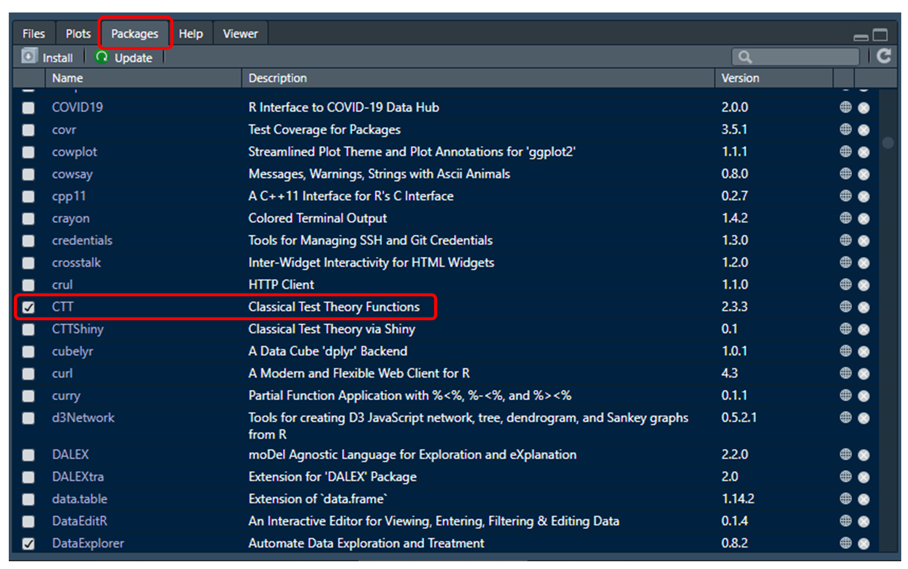
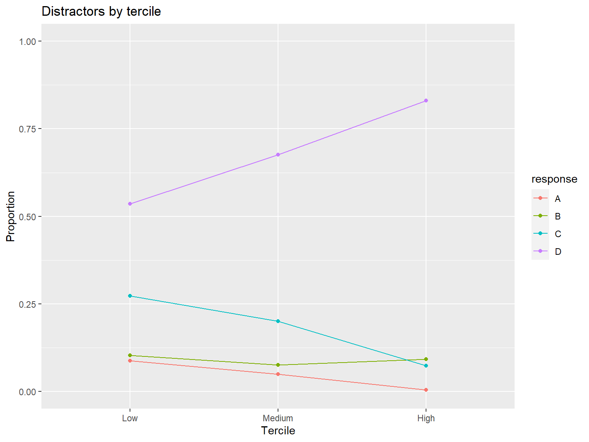

```{r setup, include = FALSE}
#Setup knitr
knitr::opts_chunk$set(echo = TRUE, eval = TRUE, warning = FALSE, background = "gray85",
                      message = FALSE, fig.width=8, fig.height=6, comment = NA,
                      fig.align = 'center')

suppressWarnings({
  library("rmarkdown")
  library("fontawesome")
  library("kableExtra")
  library("emo")
  
  # Required packages
  library("dplyr")
  library("car")
  library("skimr")
  library("DataExplorer")
  library("ggcorrplot")
  library("psych")
  library("CTT")
  library("ShinyItemAnalysis")
  library("QME")
  library("difR")
  library("rmarkdown")
})

# automatically create a bib database for R packages
# knitr::write_bib(x = c(.packages()), file = "packages.bib")
```

------------------------------------------------------------------------

# Example 1: The Need for Cognition Scale

Need for cognition, or shortly NFC, is a psychological latent trait defined as the desire to engage in cognitively challenging tasks and effortful thinking [@nfc-cacioppo]. Individuals with high levels of NFC tend to seek, acquire, think about, and reflect on information, whereas individuals with low levels of NFC tend to avoid detailed information about the world and find cognitively complex tasks stressful [@nfc-cacioppo; @nfc-chiesi]. To measure the latent trait of NFC, Cacioppo and Petty developed [the Need for Cognition Scale](https://centerofinquiry.org/uncategorized/need-for-cognition-scale-wabash-national-study/) [@nfc-cacioppo]. The original scale consisted of 34 items asking individuals to rate the extent to which they agree with statements about the satisfaction they gain from thinking (e.g., The notion of thinking abstractly is appealing to me). @nfc-short also created a shorter form of the scale with 18 items from the original scale (called NFC-18).

Although the NFC Scale is already a well-established tool, we will use it to conduct various psychometric analyses based on Classical Test Theory (CTT) and demonstrate how to evaluate the reliability and validity of this instrument. The data for our example come from a relatively recent study: "[Thinking in action: Need for Cognition predicts Self-Control together with Action Orientation](https://journals.plos.org/plosone/article?id=10.1371/journal.pone.0220282)" [@nfc-grass], focusing on the relationship between NFC and other latent traits (e.g., self-control). To measure NFC, the authors used the German version of the Need for Cognition Scale with 16 items [@nfc-bless]:

```{r nfc, eval=TRUE, echo=FALSE}
nfc_items <- data.frame(
  Items = 1:16,
  Description = c(
    "Enjoyment of tasks that involve problem-solving",
    "Preference for cognitive, difficult and important tasks",
    "Tendency to strive for goals that require mental effort",
    "Appeal of relying on one’s thought to be successful (R)",
    "Satisfaction of completing important tasks that required thinking and mental effort",
    "Preference for thinking about long-term projects (R)",
    "Preference for cognitive challenges (R)",
    "Satisfaction on hard and long deliberation (R)",
    "Attitude towards thinking as something one does primarily because one has to (R)",
    "Appeal of being responsible for handling situations that require thinking (R)",
    "Attitude towards thinking as something that is fun (R)",
    "Anticipation and avoiding of situations that may require in-depth thinking (R)",
    "Preference for puzzles to be solved",
    "Preference for complex over simple problems",
    "Preference for understanding the reason for an answer over simply knowing the answer without any background (R)",
    "Preference to know how something works over simply knowing that it works (R)")
)

nfc_items %>%
  kbl() %>%
  kable_styling(bootstrap_options = c("striped", "hover"), font_size = 16) %>%
  footnote(general = "Items marked with (R) were presented in an inverted form.",
           general_title = "Note: ",
           title_format = c("italic"),
           footnote_as_chunk = T)
```

Responses to the items were recorded on a 7-point rating scale ranging from 1 (completely disagree) to 7 (completely agree). However, to calculate total scores in the NFC Scale, the item responses must be recoded as -3 (completely disagree) to +3 (completely agree). @nfc-grass kindly shared their data files and other materials in an open repository: <https://osf.io/wn8xm/>. For the following analysis, we will use a subset of the original data including responses to the NFC Scale, demographic variables, and additional scores from criterion measures such the Self-Control Scale. This dataset can be downloaded from [**here**](data_and_codes/nfc_data.csv). In addition, the R codes for the CTT analyses presented on this page are available [**here**](data_and_codes/ctt.R).

<br>

## Setting up R

In our examples (both Example 1 and Example 2), we will conduct CTT-based analyses using the following R packages:

```{r ctt1, eval=TRUE, echo=FALSE}
pkg_dat <- data.frame(
  Package = c("dplyr", "car",
              "skimr", "DataExplorer", "ggcorrplot",
              "psych", "CTT", "ShinyItemAnalysis", "QME", "difR",
              "devtools", "rmarkdown"),
  URL = c("http://CRAN.R-project.org/package=dplyr", 
          "http://CRAN.R-project.org/package=car", 
          "http://CRAN.R-project.org/package=skimr",
          "http://CRAN.R-project.org/package=DataExplorer",
          "http://CRAN.R-project.org/package=ggcorrplot",
          "http://CRAN.R-project.org/package=psych",
          "http://CRAN.R-project.org/package=CTT",
          "http://CRAN.R-project.org/package=ShinyItemAnalysis",
          "https://github.com/zief0002/QME", 
          "http://CRAN.R-project.org/package=difR",
          "http://CRAN.R-project.org/package=devtools",
          "http://CRAN.R-project.org/package=rmarkdown")
)

kbl(pkg_dat, caption = "") %>%
  kable_paper("striped") %>%
  pack_rows("Data Cleaning and Management", 1, 2) %>%
  pack_rows("Exploratory Data Analysis", 3, 5) %>%
  pack_rows("Psychometric Analysis", 6, 10) %>%
  pack_rows("Ancillary Packages", 11, 12)
```

<br>

We can install all of the above packages by using the `install.packages()` function in R. Please remember that we only need to install these packages <u>once</u>. After that, we will be able to activate the packages in R and conduct CTT-based analysis.

```{r ctt2, eval=FALSE}
# Install all the packages together
install.packages(c("dplyr", "car", "skimr", "DataExplorer", "ggcorrplot",
                   "psych", "CTT", "ShinyItemAnalysis", "difR", "devtools", "rmarkdown"))

# Or, we could do it one by one. For example:
# install.packages("CTT")
# install.packages("psych")
# and so on...
```

Since the **QME** package [@R-QME] is available on [GitHub](https://github.com/zief0002/QME) instead of [CRAN](https://cran.r-project.org/), we will use the `install_github()` function from the **devtools** package to download the package from its repository and then install it.

```{r ctt3, eval=FALSE}
devtools::install_github("zief0002/QME") 
```

After we install the packages properly (i.e., no error messages on the R console), we can use the `library()` command to activate these packages in our R session.

```{r ctt4, eval=FALSE}
# Activate the required packages
library("dplyr")
library("car")
library("skimr")
library("DataExplorer")
library("ggcorrplot")
library("psych")
library("CTT")
library("ShinyItemAnalysis")
library("QME")
library("difR")
```

Each of these packages comes with several functions. Once we activate a package, we can start using all the functions included in that package. To see what functions are included in a given package, we can go to "Miscellaneous" pane, click on the "Packages" menu option, find the package that we want to check on the list, and click on the package name to open its function directory. For example, we can click on the **CTT** package to see what functions are included in this package.



To call a particular function from a package, we need to know the function name. For example, we can use the `alpha()` function in the **psych** package to calculate internal consistency values such as coefficient alpha. Since we are going to use multiple functions from different packages, it might be a bit difficult to remember which package each function comes from. Therefore, we will use the following format in the codes: `packagename::function`. For example, `psych::alpha()` indicates that we are calling the `alpha()` function from the **psych** package. If there is no "::" included in the function name (e.g., `plot()`), it means that we are using a built-in R function (i.e., a function that comes with the base R). 

------------------------------------------------------------------------

> `r emo::ji("bell")` [**INFORMATION:**]{style="color:blue"} Using `::` has two more benefits. First, when we use `::`, we can call a particular function from a package without activating the entire package. For example, `psych::alpha()` allows us to use the `alpha()` function without having to run `library("psych")` beforehand. Second, if two or more packages activated within an R session include a function with the same name, then R only gives us access the function from the most recently activated package. This is called "masking". For example, the **ggplot2** package also has an `alpha()` function. If we first loaded **psych** and then **ggplot2**, the `alpha()` from **ggplot2** would mask the `alpha()` function from **psych**. However, by using `psych::alpha()`, we can still access the `alpha()` function from **psych**.

------------------------------------------------------------------------

## Exploratory data analysis

[Exploratory data analysis (EDA)](https://okanbulut.github.io/bigdata/eda.html) refers to the process of performing initial investigations on data in order to detect anomalies (e.g., unexpected values, high levels of missigness), check various assumptions (e.g., normality), and discover interesting patterns. When performing EDA, we often use both statistical and data visualization tools to summarize the data.

Before we begin the analysis, let's set up our working directory. I created a new folder called "CTT Analysis" on my desktop and put our data ([nfc_data.csv](data_and_codes/nfc_data.csv)) into this folder. You can also create the same folder in a convenient location in your computer and save the path to this folder. Now, we can change our working directory to this new folder:

```{r ctt5, eval=FALSE}
setwd("C:/Users/Okan/Desktop/CTT Analysis")
```

------------------------------------------------------------------------

> `r emo::ji("+1")` [**SUGGESTION:**]{style="color:green"} We will use several datasets in the following examples. Downloading and putting all the data files into your working directory will make accessing these files easier.

------------------------------------------------------------------------

Next, we will import the data into R. Since nfc_data.csv is a comma-separated-values file (see the .csv extension), we will use the `read.csv()` function to read our data into R and then save it as "nfc".

```{r ctt6, eval=FALSE}
nfc <- read.csv("nfc_data.csv", header = TRUE)
```

Using the `head()` function, we can now view the first 6 rows of the dataset:

```{r ctt7, eval=FALSE}
head(nfc)
```

Additionally, we can use `View(nfc)` that opens the data viewer in RStudio and allows us to open the data in a spreadsheet-like format. 

```{r ctt8, echo=FALSE, R.options = list(width = 110)}
nfc <- read.csv(paste0(getwd(), "/data_and_codes/nfc_data.csv"), header = TRUE)
head(nfc)
#paged_table(nfc, options = list(cols.print = 12, rows.print = 6))
```

We can also see the names and types of the variables in our dataset using the `str()` function (which shows us the **str**ucture of the data):

```{r ctt9, echo=TRUE}
str(nfc)
```

The dataset consists of 1209 rows (i.e., participants) and 23 variables (id, age, sex, education, nfc01 to nfc16 representing the responses to the NFC Scale items, and three scores for criterion measures). We can obtain a bit more information on the dataset using the `introduce()` and `plot_intro()` functions from the **DataExplorer** package [@R-DataExplorer]:

```{r ctt10, echo=TRUE, eval=FALSE}
DataExplorer::introduce(nfc)
```

```{r ctt11, echo=FALSE}
kbl(t(introduce(nfc)), 
    row.names = TRUE, col.names = "", 
    format.args = list(big.mark = ",")) %>%
  kable_styling()
```

The output above gives us a summary of our dataset with additional information on the total number of missing values, total number of observations, and so on.

```{r ctt12, echo=TRUE}
DataExplorer::plot_intro(nfc)
```

The plot above shows that most of the variables are continuous (note that R recognizes Likert-scale items as continuous variables although they are actually ordinal) while there are also some discrete (i.e., categorical) variables (i.e., sex and education) in the dataset. We also see that some of the variables in the dataset have missing values but the proportion of missing data is very small (only 0.023%). Depending on the sample size, missingness \> 10% is often concerning as the loss of information due to these missing values is likely to influence the results of our analysis.

To have a closer look at missing values, we can visualize the proportion of missingness for each variable. The following plot shows that age and sex have some missing values but the proportion of missingness is very small (less than 1%).

```{r ctt13a, echo=TRUE}
DataExplorer::plot_missing(nfc)
```

The **DataExplorer** package also has additional functions to visualize both categorical and continuous variables. The package is using a simpler language to create plots based on the **ggplot2** package [@R-ggplot2] in the background.

```{r ctt13b, echo=TRUE, fig.height=4}
# Categorical variables (bar plots)
DataExplorer::plot_bar(data = nfc[, c("education", "sex")])

# Continuous variables (histogram)
DataExplorer::plot_histogram(data = nfc[, c("age", "self_control", "action_orientation", "effortful_control")])

# Continuous variables (boxplot) by a categorical variable
DataExplorer::plot_boxplot(data = nfc[!is.na(nfc$sex), # select cases where sex is not missing
                                      # Select variables of interest
                                      c("sex", "self_control", "action_orientation", "effortful_control")], 
                           by = "sex") # Draw boxplots by sex (a categorical variable)
```

To organize all the summary statistics into a single report, we could use the `create_report()` function. It runs most functions in **DataExplorer** and outputs a HTML report file (assuming **rmarkdown** has been already installed).

```{r ctt13c, echo=TRUE, eval=FALSE}
# Drop the id variable so it doesn't get analyzed with the other variables
nfc <- DataExplorer::drop_columns(nfc, "id")

# This code creates a report and saves it into the working directory
DataExplorer::create_report(data = nfc,
                            report_title = "NFC Scale Analysis",
                            output_file = "nfc_report.html")
```

To obtain a detailed summary of the nfc dataset within a single analysis, we can use the `skim()` function from the **skimr** package [@R-skimr]. As you can see from the output below, we obtained similar descriptive statistics for the variables in the nfc dataset:

-   "Data Summary" shows the number of columns/rows and column types (i.e., variable types)
-   "Variable type" tables show a summary of character (i.e., categorical) and numeric (i.e., continuous) variables

In "Variable type: character", we see the number of missing values, complete data rate, the minimum number of characters (e.g., 4 for sex: male) and maximum number of characters (e.g., 6 for sex: female), and the number of unique values (e.g., 2 for sex: male and female) for the variables.

In "Variable type: numeric", we see the number of missing values, complete data rate, mean, standard deviation, min (p0), 25th percentile (p25), median (p50), 75% percentile (p75), and max (p100) values for the variables.

```{r ctt14, eval=FALSE}
skimr::skim(nfc)
```

```{r ctt15a, echo=FALSE, R.options = list(width = 200)}
skimr::skim_without_charts(data = nfc) %>%
  print()
```

The `describe()` function from the **psych** package [@R-psych] is another useful function to get basic descriptive statistics for data collected for psychometric and psychology studies (see `?psych::describe` for more details about this function).

```{r ctt15b, echo=FALSE, R.options = list(width = 200)}
psych::describe(x = nfc)
```

<br>

Before moving to item analysis, we should also check the correlations among the items to gauge how strongly the items are associated with each other. We expect the items to be associated with each other up to a certain degree because we assume that the items measure the same latent trait (the construct of NFC in this example). Having weakly-correlated items suggests that some items may **not** be measuring the same latent trait. Having very highly-correlated items (e.g., $r > .95$) suggests that there is some redundancy in the instrument because some items provide us with the same information about the individuals who answered the items.

In addition, we know that some items in the NFC Scale are negatively-worded and thus responses to these items may be in the opposite direction with the rest of the items. For example, individuals with high NFC are likely to choose "7 = completely agree" for a positively-worded item such as "Enjoyment of tasks that involve problem-solving" whereas they are expected to choose "1 = completely disagree" for a negatively-worded item such as "Anticipation and avoiding of situations that may require in-depth thinking".

Now, we will create a correlation matrix of the NFC items and review the strength and direction of the relationships among the items. First, we will save the responses as a separate dataset to make our subsequent analyses easier. The items in the nfc dataset are named as nfc01, nfc02, ..., nfc16. That is, they all start with the same prefix: nfc. So, we can use this prefix to select the items more easily. We will use the `select()` function from **dplyr**. `starts_with("nfc")` will help us choose the variables starting with "nfc" as a selection condition.

```{r ctt16, echo=TRUE}
response <- dplyr::select(nfc, # name of the dataset
                          starts_with("nfc")) # variables to be selected

head(response)
```

Alternatively, we could type each item by one one (which is much more tedious):

```{r ctt17, eval=FALSE}
response <- dplyr::select(nfc, # name of the dataset
                          nfc01, nfc02, nfc03, nfc04, ..., nfc16) # variables to be selected
```

Next, we will compute the correlations among these items. Remember that the NFC items follow an ordinal scale: 1=completely disagree to 7=completely agree. Therefore, instead of Pearson correlation (which can be obtained using the `cor()` function in R), we will use the `polychoric()` function from **psych** to calculate polychoric correlations. The `polychoric()` function produces several outcomes but we only want to keep `rho`- (i.e., the correlation matrix of the items).

```{r ctt18, eval=FALSE}
# Save the correlation matrix
cormat <- psych::polychoric(x = response)$rho

# Print the correlation matrix
print(cormat)
```

```{r ctt19, echo=FALSE}
cormat <- polychoric(x = response)$rho

cormat %>%
  kbl() %>%
  kable_styling(bootstrap_options = c("striped", "condensed"), font_size = 11)
```

One thing that we can see right away is negative values in the correlation matrix, confirming that some items are indeed negatively correlated with each other. However, reviewing the rest of this 16x16 correlation matrix is not necessarily easy. We can't just eyeball the values to evaluate the associations among the items. Therefore, we will create a correlation matrix plot using the **ggcorrplot** package [@R-ggcorrplot]. The package has a function with the same name, `ggcorrplot()`, that transforms a correlation matrix into a nice correlation matrix plot (note that a similar plot can be created using `corPlot()` from **psych**).

```{r ctt20, echo=TRUE, fig.width=9, fig.height=6}
ggcorrplot::ggcorrplot(corr = cormat, # correlation matrix
                       type = "lower", # print only the lower part of the correlation matrix
                       show.diag = TRUE, # show the diagonal values of 1
                       lab = TRUE, # add correlation values as labels
                       lab_size = 3) # Size of the labels
```

There are tons of options to customize the correlation matrix plot (run `?ggcorrplot::ggcorrplot` to see the help page), but this is already a very good visualization for us to evaluate the correlations among the items. We see that several items on the scale (see the blue-coloured boxes) are negatively correlated with the rest of the items. These are the (R) marked items in the NFC Scale (i.e., negatively-worded items). We will go ahead and reverse-code the responses to these items (i.e., 1=completely agree to 7=completely disagree) to put all the items in the same direction.

We will use the `reverse.code()` function from **psych** for this process. We will create a reverse-coding key where "1" keeps the item the same and "-1" reverse-codes the item. In `nfc_key` below, we type "1" three times (no reverse-coding for the first three items), type "-1" for the 4th item (reverse-code the item), type 1 for the 5th item (no reverse-coding), and so on. That is, the values in `nfc_key` correspond to the positions of the items in the `response` dataset. Then, we use `reverse.code()` to apply the key and transform the data (saved as `response_recoded`).

```{r ctt21, echo=TRUE}
# -1 means reverse-code the item
nfc_key <- c(1,1,1,-1,1,-1,-1,-1,-1,-1,-1,-1,1,1,-1,-1)

response_recoded <- psych::reverse.code(
  keys = nfc_key, # reverse-coding key
  items = response, # dataset to be transformed
  mini = 1, # minimum response value
  maxi = 7) # maximum response value
```

Let's see if our transformation worked:

```{r ctt22, echo=TRUE, fig.width=9, fig.height=6}
cormat_recoded <- psych::polychoric(response_recoded)$rho

ggcorrplot::ggcorrplot(corr = cormat_recoded,
                       type = "lower", 
                       show.diag = TRUE,
                       lab = TRUE, 
                       lab_size = 3) 
```

We can see in the correlation matrix plot that all the items are now positively correlated with each other. Most correlations are moderate while there also some items (e.g., nfc06) that seem to have low correlations with the other items in the NFC scale. Also, we see that `reverse.code()` changed the names of the reverse-coded items by include "-" at the end (e.g., nfc04-). This is not necessarily a problem. However, if we want to keep the original variable names (i.e., nfc01 to nfc16), we can rename the column names using the `colnames()` function. The following will replace the column names of the transformed data (i.e., `response_recoded`) with the column names of the original response data (i.e., `response`) and then save the dataset as a data frame (the typical data format in R).

```{r ctt23, echo=TRUE, R.options = list(width = 200)}
# Rename the columns
colnames(response_recoded) <- colnames(response)

# Save the data as a data frame
response_recoded <- as.data.frame(response_recoded)

# Preview the first six rows of the data
head(response_recoded)
```

<br>

## Item analysis

Item analysis refers to the analysis of individual items on a measurement instrument in terms of descriptive statistics (e.g., mean, standard deviation, min, and max), item-level statistics (e.g., difficulty and discrimination), and their associations with scale-level statistics (e.g., reliability). In R, there are several packages to conduct item analysis on dichotomous items (i.e., 0 or 1) and ordinal items (e.g., Likert-scale items). I will demonstrate three of these packages below:

**CTT** [@R-CTT]: The `itemAnalysis()` function runs item analysis and returns a brief but useful table of item statistics. Specifying the dataset to be analyzed (response_recoded) in the `itemAnalysis()` function is enough to run item analysis. In the following example, we will also set two flags for point-biserial correlation (pBisFlag) and biserial correlation (bisFlag). Both of these statistics indicate the discriminatory power of the items. In practice, we prefer both point-biserial correlation and biserial correlation values to be at least 0.2 or larger. So, we will set the flag at 0.2 so that the function shows us (using an "X" sign) the items with discrimination of .2 or less (see more details on the help page via `?CTT::itemAnalysis`).

```{r ctt24, echo=TRUE}
# Run the item analysis and save it as itemanalysis_ctt
itemanalysis_ctt <- CTT::itemAnalysis(items = response_recoded, pBisFlag = .2, bisFlag = .2)

# Print the item report
itemanalysis_ctt$itemReport
```

In the output above, "itemMean" is the average response value for each item (which is not necessarily useful given that our items are ordinal), "pBis" and "bis" refer to point-biserial and bi-serial correlations respectively, "alphaIfDeleted" indicates how the reliability of the instrument would change if each item were to be removed (we will discuss reliability in the next section), and the last two columns ("lowPBis" and "lowBis") are the columns where we would see flags (i.e., X marks) if the values are less than 0.2. In this example, all the items seem to have pBis and bis values larger than 0.2 and thus there are no flagged items.

<br>

**psych** [@R-psych]: The `alpha()` function runs item analysis and returns a detailed output with both item-level and scale-level statistics. To use the function, we need to specify the response dataset to be analyzed (i.e., `x = response_recoded`). The function also involves other arguments (e.g., `na.rm = TRUE` to remove missing values and find pairwise correlations), but the default values for these arguments are sufficient to conduct item analysis (see more details on the help page via `?psych::alpha`).

```{r ctt25, echo=TRUE}
# Run the item analysis and save it as itemanalysis_psych
itemanalysis_psych <- psych::alpha(x = response_recoded)

# Print the results
itemanalysis_psych
```

The first part of the output shows the results of reliability analysis but we will discuss these results in the next section. For now, let's focus on "Item statistics" and "Non missing response frequency for each item".

**Item statistics:** The table shows the number of valid responses for each item (n), correlations between the items and the total score from the instrument (raw.r) where the item itself is included in the calculation of the total score, correlations between the items and the total score if the items were all standardized (std.r), correlations between the items and the total score corrected for both item overlap and scale reliability (r.cor), correlations between the items and the total score where the item of interest is *not* included in the calculation of the total score (r.drop), average response values (mean), and standard deviation of response values (sd). Compared with raw.r, r.cor and r.drop are better indicators of item discrimination as they indicate the relationship between each item and the rest of the items without contaminating the total score. We want r.cor and r.drop values to be larger than 0.2 for each item.

**Non missing response frequency for each item:** The table shows what percentages of respondents selected each response option of the each of the items. Each item in the NFC Scale have response options of 1 to 7 and thus we see each of these response options and the missing response in the last column. This table helps us check the distribution of response options and whether all or almost all respondents selected the same response options for some items (which lowers the reliability). In our example, we can see that the lowest response option (i.e., 1) was selected by a very low proportion of respondents whereas the middle and upper response categories (i.e., 4, 5, 6, and 7) were selected by much more respondents.

<br>

**ShinyItemAnalysis** [@R-ShinyItemAnalysis]: The `ItemAnalysis()` function runs item analysis and returns much more detailed output compared with those of **CTT** and **psych**. The function has so many options that allows users to customize the item analysis report in several ways (see more details on the help page via `?ShinyItemAnalysis::ItemAnalysis`). Also, using the `startShinyItemAnalysis()` function, we can use the interactive version of `ItemAnalysis()` where we can import the data and select the analysis to be conducted using a nice user interface based on the **shiny** package (for examples of interesting **shiny** applications, see <https://shiny.rstudio.com/>).

```{r ctt26a, echo=TRUE, R.options = list(width = 110)}
# Run the item analysis and save it as itemanalysis_shiny
itemanalysis_shiny <- ShinyItemAnalysis::ItemAnalysis(Data = response_recoded)

# Print the results
itemanalysis_shiny
```

In the output above, there is tons of information regarding the items, but the ones we will focus on include:

-   Difficulty: A standardized difficulty value between 0 and 1 based on the average score of the item divided by its range
-   Mean: Average item score (again, not very useful for ordinal items)
-   SD: Standard deviation of item scores
-   RIT: Correlations between item scores and the total test score (same as r.raw from **psych**)
-   RIR: Correlations between item scores and the total test score without the given item (same as r.drop from **psych**)

The **ShinyItemAnalysis** package also includes a `DDplot()` function to visualize standardized difficulty and discrimination statistics together. For the `discrim` argument, we will use "RIR" to plot *corrected* item discrimination values (alternatively, we could use "RIT" for uncorrected discrimination values or "none" to plot only difficulty values).

```{r ctt26b, echo=TRUE, R.options = list(width = 100)}
# Create a difficulty and discrimination (DD) plot
ShinyItemAnalysis::DDplot(Data = response_recoded, discrim = "RIR")
```

<br>

## Reliability

### Split-half reliability

As a simple measure of reliability, split-half reliability can be obtained by splitting a measurement instrument into two equivalent halves, calculating the total scores on the two halves, and correlating them. There are several ways to create the split-half (e.g., selecting every other items, randomly, etc.). Below, we will define a custom R function to calculate the split-half reliability (this function originally comes from the [**hemp**](https://github.com/cddesja/hemp) package). To create the split-half, we can choose either `type = "alternate"` to select every other item (i.e., odd and even numbered items) or `type == "random"` to select two sets of items randomly. The `seed` argument is just an integer for us to control random sampling if we choose `type == "random"`. Changing the seed will allow us to sample a different set of items when we run the function every time.

```{r ctt27, echo=TRUE}
split_half <- function(data, type = "alternate", seed = 2022) {
  
  # Select every other item
  if (type == "alternate") {
    first_half <- data[, seq(1, ncol(data), by = 2)]
    second_half <- data[, seq(2, ncol(data), by = 2)]
    first_total <- rowSums(first_half, na.rm = T)
    second_total <- rowSums(second_half, na.rm = T)
    rel <- round(cor(first_total, second_total), 3)}
  
  # Select two halves randomly
  if (type == "random") {
    set.seed(seed)
    num_items <- 1:ncol(data)
    first_items <- sample(num_items, ncol(data)/2)
    first_half <- data[, first_items]
    second_half <- data[, -first_items]
    first_total <- rowSums(first_half, na.rm = T)
    second_total <- rowSums(second_half, na.rm = T)
    rel <- round(cor(first_total, second_total), 3)}
  
  return(rel)
}
```

Now, let's see what the `split_half()` function gives us for the NFC Scale:

```{r ctt28, echo=TRUE}
split_half(data = response_recoded, type = "alternate")

split_half(data = response_recoded, type = "random", seed = 2022)
```

By changing the seed, we can run the `split_half()` function many times, obtain a sample of split-half reliability estimates, and find the average of these estimates as our final split-half reliability value. Luckily, this process is much easier with `splitHalf()` function in the **psych** package. This functions calculates all (or at least a large number of) possible split-half reliability values for a given dataset. Only specifying the dataset to be analyzed is sufficient to use this function.

```{r ctt29a, echo=TRUE}
psych::splitHalf(r = response_recoded)
```

In the output above, we see that the minimum and maximum split-half reliability estimates are 0.78 and 0.92, respectively. The output also reports the average values of all split-half reliability estimates as 0.87. Now, let's take a closer look at the split-half reliability estimates we obtained for the NFC Scale. Using the `raw = TRUE` argument, we will save all the split-half reliability values and then visualize them using a histogram (with `hist()`). The following histogram shows how the split-half reliability estimates the NFC scale vary.

```{r ctt29b, echo=TRUE}
# Save the reliability results as sp_rel
sp_rel <- psych::splitHalf(r = response_recoded, raw = TRUE)

hist(x = sp_rel$raw, # extract the raw reliability values saved in sp_rel
     breaks = 101, # the number of breakpoints between histogram cells
     xlab = "Split-Half Reliability", # label for the x-axis
     main = "All Split-Half Reliabilities for the NFC Scale") # title for the histogram

# Add a red, vertical line showing the mean
# here v is a (v)ertical line
# col is the colour of the line
# lwd is the width of the line (the larger, the thicker line)
# lty is the line type (1 = solid, 2 = dashed, etc.)
# See http://www.sthda.com/english/wiki/line-types-in-r-lty for more details
abline(v = mean(sp_rel$raw), col = "red", lwd = 2, lty = 2)
```

### Internal consistency

Next, we will calculate internal consistency, more specifically coefficient alpha (**NOT** Cronbach's alpha), for the NFC Scale. Internal consistency is the degree of homogeneity among the items on a measurement instrument. It allows us to gauge how strongly the items in a given instrument are associated with each other. A common misconception about internal consistency is that coefficient alpha and its variants can tell us how well a measurement instrument is actually measuring what we want it to measure, which is **INCORRECT**. If the items measure the same target construct (which may not necessarily be what we wanted to measure), then they are expected to be internally consistent with one another (i.e., correlated) and yield reliable (i.e., consistent) results.

There are multiple ways to compute internal consistency in R. Earlier we conducted item analysis using the **CTT** package, saved the results as `itemanalysis_ctt`, and printed the item analysis results using `itemanalysis_ctt$itemReport`. Using the same results, we can also see the estimate of coefficient alpha for the NFC Scale by simply printing the results:

```{r ctt30a, echo=TRUE}
# Print the results
itemanalysis_ctt
```

Similarly, when we conducted item analysis using the `alpha()` function in **psych**, we also obtained the internal consistency results. Printing `itemanalysis_psych` again, we can see the following results:

```{r ctt30b, echo=TRUE, eval=FALSE, background = "gray85"}
Reliability analysis   
Call: psych::alpha(x = response_recoded)

  raw_alpha std.alpha G6(smc) average_r S/N    ase mean   sd median_r
       0.87      0.87    0.88       0.3 6.8 0.0054    5 0.82     0.29

 lower alpha upper     95% confidence boundaries
0.86 0.87 0.88 

 Reliability if an item is dropped:
      raw_alpha std.alpha G6(smc) average_r S/N alpha se  var.r med.r
nfc01      0.86      0.86    0.87      0.29 6.2   0.0059 0.0098  0.27
nfc02      0.86      0.86    0.87      0.29 6.2   0.0059 0.0091  0.28
nfc03      0.86      0.86    0.88      0.30 6.4   0.0058 0.0094  0.29
nfc04      0.87      0.87    0.88      0.31 6.6   0.0056 0.0098  0.30
nfc05      0.86      0.87    0.88      0.30 6.5   0.0057 0.0100  0.30
nfc06      0.87      0.87    0.89      0.31 6.9   0.0054 0.0084  0.31
nfc07      0.86      0.86    0.87      0.29 6.0   0.0060 0.0092  0.27
nfc08      0.86      0.86    0.88      0.29 6.3   0.0059 0.0098  0.28
nfc09      0.86      0.87    0.88      0.30 6.4   0.0057 0.0097  0.30
nfc10      0.86      0.87    0.88      0.30 6.4   0.0058 0.0099  0.29
nfc11      0.86      0.86    0.87      0.29 6.2   0.0059 0.0096  0.28
nfc12      0.86      0.87    0.88      0.30 6.4   0.0058 0.0098  0.29
nfc13      0.86      0.86    0.87      0.30 6.3   0.0058 0.0091  0.29
nfc14      0.87      0.87    0.88      0.30 6.5   0.0057 0.0088  0.29
nfc15      0.86      0.87    0.87      0.30 6.5   0.0057 0.0084  0.30
nfc16      0.87      0.87    0.87      0.30 6.5   0.0057 0.0083  0.30
```

In the output above, we see the following statistics:

-   raw_alpha: Coefficient alpha based on the covariances among the items (values ≥ 0.7 indicate "acceptable" reliability)
-   std.alpha: Standardized coefficient alpha based on the correlations among the items
-   G6: Guttman's Lambda 6 reliability
-   average_r: Average inter-item correlations
-   S/N: Signal/Noise ratio where $s/n = n r/(1-r)$
-   ase: Coefficient alpha's standard error
-   mean: The mean of the scale formed by averaging or summing the items
-   sd: The standard deviation of the total score
-   median_r: Median inter-item correlations

Among these values, we use raw_alpha to interpret the internal consistency. For the NFC Scale, $\alpha = 0.87$ indicates high internal consistency. The second part of the output under "Reliability if an item is dropped" shows how internal consistency changes after each item is removed from the instrument. In our example, the raw_alpha column shows that the internal consistency either remains the same or goes down to 0.86, suggesting that removing none of the items would help us improve the reliability and so we should retain the original scale.

Lastly, we will use the **QME** package [@R-QME] to calculate internal consistency for the NFC Scale. In addition to coefficient alpha and Guttman's lambda reliability statistics, the **QME** package also calculates Feldt-Gilmer and Feldt-Brennan reliability statistics. Using the `analyze()` function, we will first analyze the dataset and then print the results. By default, the `analyze()` function assumes that the dataset include an ID column for respondents but our dataset doesn't have this column. Therefore, we will use `id = FALSE` to change this setting. In addition, we will use `na_to_0 = FALSE` not to recode missing responses as zero when running the analysis (even though the nfc dataset does not include any missing responses).

```{r ctt31, echo=TRUE}
reliability_qme <- QME::analyze(test = response_recoded, id = FALSE, na_to_0 = FALSE)
reliability_qme
```

The output gives us some descriptive statistics based on the total score and reliability statistics at the bottom. The reliability values we obtained from **psych**, **CTT**, and **QME** are nearly the same (it is possible to see some minor differences due to rounding error, etc.)

As we conclude the internal consistency section, we will run a small experiment to see how the correlations among the items affect the internal consistency of an instrument. In the following example, we will replace the responses to the first two items in the NFC Scale. Instead of original responses, we will randomly generate values between 1 and 7, replace the original responses with these random values, and then check the internal consistency again.

```{r ctt31b, echo=TRUE, fig.width=9, fig.height=6}
# Create a copy of the original response dataset
response_experiment <- response_recoded

# Set the seed to control random number generation
set.seed(seed = 2525)

# Generate random integer values between 1 and 7 and replace the original responses with them
response_experiment$nfc01 <- sample.int(n = 7, size = nrow(response_experiment), replace = TRUE)
response_experiment$nfc02 <- sample.int(n = 7, size = nrow(response_experiment), replace = TRUE)

# Check the correlations among the items using the new dataset
cormat_experiment <- psych::polychoric(response_experiment)$rho

ggcorrplot::ggcorrplot(corr = cormat_experiment,
                       type = "lower", 
                       show.diag = TRUE,
                       lab = TRUE, 
                       lab_size = 3) 

# Now check the internal consistency
QME::analyze(test = response_experiment, id = FALSE, na_to_0 = FALSE)
```

After replacing the original responses with random values between 1 and 7, we see that the correlation between the first two items and the remaining items disappeared. In fact, some correlations are even negative. This finding is not surprising because the randomly-generated values would not necessarily be correlated with the other items. The output from the `analyze()` function shows that the internal consistency for this new dataset is 0.79 (as opposed to 0.87 in the original dataset). Given the length of the NFC Scale (16 items), having two poor quality items significantly decreased the internal consistency of the scale.

Although this is an exaggerated example, it still demonstrates how to identify problematic items in a given measurement instrument. Using the correlations among the items, discrimination values (i.e., item-total correlation), and the impact of removing each item on the internal consistency, we can identify poor quality items (or potentially problematic items) and shorten our measurement instrument (assuming the remaining items indicate a decent level of internal consistency). There are also more sophisticated ways to identify and remove items for the purpose of creating a shorter instrument, such as the genetic algorithm and ant colony optimization (see [my blog post](https://okan.cloud/posts/2021-01-19-how-to-shorten-a-measurement-instrument-automatically-part-ii/) on how to implement these methods in R).

<br>

### Spearman-Brown prophecy formula

Before we conclude the reliability section, we will also use the Spearman-Brown prophecy formula to predict the internal consistency of the NFC Scale depending on the number of items in the instrument. First, we will examine the scenario where we decide to shorten the length of the NFC scale by a factor of 0.5 (i.e., reducing the length from 16 items to 8 items). In the earlier analysis, we estimated the internal consistency of the NFC scale as $\alpha = 0.87$. Using the `spearman.brown()` function from **CTT**, we will compute how the internal consistency would change if we reduced the length to 8 items. We specify the current value of internal consistency (`r.xx = 0.87`), the desired length (`input = 0.5`), and how we want to use the function (`n.or.r = "n"` for finding the new internal consistency or `n.or.r = "r"` for finding the new length).

```{r ctt32, echo=TRUE}
CTT::spearman.brown(r.xx = 0.87, input = 0.5, n.or.r = "n")
```

The output shows that if we had to reduce the length of the NFC Scale from 16 items to 8 items, the internal consistency would become roughly 0.77. In the second scenario, we will see how many more items we would need to increase the internal consistency from 0.87 (current value) to 0.90 (target value). So, we will use `input = 0.90` to indicate our target reliability and `n.or.r = "r"` to request for the new length for the NFC scale. We will save the result as n (the factor that our instrument should be lengthened) and then multiply this value with the current number of items (16) to find the desired number of items required for $\alpha = 0.90$.

```{r ctt33, echo=TRUE}
# Save the result as n
n <- CTT::spearman.brown(r.xx = 0.87, input = 0.90, n.or.r = "r")

# Multiply it with the current length and round it with zero digits
round(n$n.new * 16, digits = 0)
```

The result above shows that we would need 22 items (i.e., 6 additional items with similar characteristics as the original NFC items) to reach the internal consistency level of 0.90.

<br>

## Criterion-related validity

In the last step of analyzing the dataset from the NFC Scale, we will examine criterion-related validity. Criterion-related validity indicates how well a measurement instrument predicts the outcome for another instrument measuring the same (or similar construct) construct. If both instruments (i.e., the instrument of interest and the criterion measure) are administered at the same time, we can correlate the scores from the two instruments to check *concurrent validity*. If we use the scores from the current instrument to predict scores from a criterion measure in the future, then we can obtain evidence for *predictive validity*.

In the following example, we will calculate the scores for the NFC scale and then correlate the scores with

-   self-control scores from the short form of the Self-Control Scale [@sc-bertrams],
-   effortful control scores from the Effortful Control Scale of the Adult Temperament Questionnaire [@ec-wiltink], and
-   action orientation scores from the Action Control Scale [@ac-kuhl].

Based on the findings of previous research, we expect to find positive, small to medium associations between NFC and the other three constructs (self-control, effortful control, and action control).

First, we will use the `recode()` function from the **car** package [@R-car] to recode the item scores of 1 to 7 as -3 to +3 for the NFC Scale and then sum up the item scores to calculate the total score for the NFC Scale. Since we want to replicate the same recoding procedure for all 16 items, we will create a custom function for recoding the items and apply it to the whole dataset using `apply()`, use the `rowSums()` function to calculate the total score for each person (i.e., the sum of each row in the recoded dataset), obtain a descriptive summary of the scores using `summary()`, and visualize the distribution of the scores using `hist()`.

```{r ctt34, echo=TRUE}
# Our custom recode function
recode_nfc <- function(x) {
  car::recode(x, "1=-3; 2=-2; 3=-1; 4=0; 5=1; 6=2; 7=3")
}

# Recode the responses
response_recoded <- apply(response_recoded, # data to be modified
                          2, # 2 to apply a function to each column (or 1 for each row)
                          recode_nfc) # Function to be applied


# Compute the NFC Scale scores
nfc_score <- rowSums(response_recoded)

# Summarize the scores
summary(nfc_score)

# Visualize the distribution of the NFC Scale scores
hist(nfc_score,
     xlab = "NFC Scale Score",
     main = "Distribution of the NFC Scale Scores")
```

The histogram shows that the NFC Scale scores have a slightly left-skewed distribution centered around 16.6. Next, we can merge the scores NFC Scale with the scores from the other scales in a single dataset. We will use the `cbind()` function to bind (i.e., combine) the four scores. Note that we can use `cbind()` to add the columns side by side because we have **not** changed the order of respondents in the "response_recoded" and "nfc" datasets. If we had changed the order of respondents, we would have to use `merge()` to merge the datasets based on a common variable (e.g., the "id" variable) to match the respondents properly.

```{r ctt35, echo=TRUE}
scores <- cbind(nfc_score, nfc[, c("action_orientation", "self_control", "effortful_control")])
```

Next, we will calculate the correlations among these four scores (using `cor()`) and also visualize the correlations (using `ggcorrplot()`). `cor()`, by default, calculates Pearson correlations between numerical variables. Although we don't have any missing scores, we will add `use = "pairwise.complete.obs"`--which would keep valid cases for each pair of variables when calculating the correlations. Without specifying this option, `cor()` would fail to calculate the correlations for a dataset with missing (i.e., NA) values and return NA.

```{r ctt36, echo=TRUE, eval=FALSE}
cormat_scores <- cor(scores, use = "pairwise.complete.obs")

print(cormat_scores)

ggcorrplot::ggcorrplot(corr = cormat_scores,
                       type = "lower", 
                       show.diag = TRUE,
                       lab = TRUE, 
                       lab_size = 3) 
```

```{r ctt37, echo=FALSE, eval=TRUE, fig.width=9, fig.height=6}
cormat_scores <- cor(scores, use = "pairwise.complete.obs")

cormat_scores %>%
  round(., 2) %>%
  kbl() %>%
  kable_styling(bootstrap_options = c("striped", "condensed"), font_size = 13)

ggcorrplot::ggcorrplot(corr = cormat_scores,
                       type = "lower", 
                       show.diag = TRUE,
                       lab = TRUE,                       
                       lab_size = 3) 
```

The correlation matrix plot above shows that there is indeed a positive, small to moderate correlation between the NFC Scale scores and the scores from the other scales. Remember that these are just raw correlations among the scale scores. That is, they are **not** corrected for attenuation due to the measurement error involved in each scale. To obtained the disattenuated correlations, we will use the `correct.cor()` function from the **psych** package. To use this function, we need to list a raw correlation matrix of scale scores and a vector of reliability (i.e., internal consistency) estimates. The reliability estimate for the NFC Scale is 0.87 and the reliability estimates for the three criterion measures are [@nfc-grass]:

-   The Action Control Scale: 0.791
-   The Self-Control Scale: 0.817
-   The Effortful Control Scale: 0.783

Using this information, we can calculate the disattenuated correlations as follows:

```{r ctt38, echo=TRUE, eval=FALSE}
psych::correct.cor(x = cormat_scores, # Raw correlation matrix
                   y = c(0.87, 0.791, 0.817, 0.783)) # Reliability values in the same order as cormat_scores
```

```{r ctt39, echo=FALSE, eval=TRUE}
psych::correct.cor(x = cormat_scores, # Raw correlation matrix
                   y = c(0.87, 0.791, 0.817, 0.783)) %>%
  round(., 2) %>%
  kbl() %>%
  kable_styling(bootstrap_options = c("striped", "condensed"), font_size = 13)
```

In the new correlation matrix above, the upper-diagonal part shows the correlations among the four scale scores that have been corrected for attenuation, the diagonal part shows the reliability estimates for the four scales, and the lower-diagonal part shows the original (i.e., raw) correlations among the four scale scores. After applying the correction for attenuation, the new correlation values have become higher than their raw counterparts. For example, the scores from the NFC scale has a correlation of $r = .29$ with the scores from the Effortful Control Scale, whereas the corrected correlation between the two scales is $r = .35$.

In addition to the relationship between the total scores from the NFC Scale and the criterion measures, we can also calculate item-validity index (IVI) to check the relationship between each item in the NFC Scale and the scores from the criterion measures. IVI can range between -0.5 and 0.5, with large values (in absolute magnitude) indicative of higher validity. In the following example, we will create a custom IVI function and apply it to the NFC Scale to calculate the IVI values using the action orientation scores as a criterion measure (the `ivi()` function originally comes from the [**hemp**](https://github.com/cddesja/hemp) package).

```{r ctt40, echo=TRUE}
# Custom function for calculating item-validity index
ivi <- function(item, criterion) {
    s_i <- sd(item, na.rm = TRUE)
    r <- cor(item, criterion, use = "complete.obs")
    index <- s_i * r
    return(index)
}

# Apply the ivi function to the NFC items
nfc_ivi <- apply(response_recoded, 
                 2,                
                 function(x) ivi(item = x, criterion = nfc$action_orientation))

# Save the results as a data frame and print them
nfc_ivi <- as.data.frame(nfc_ivi)
print(nfc_ivi)
```

The output above shows that most items in the NFC Scale have small to moderate correlations with the action orientation scores (just like the total scores from the NFC Scale), except for nfc05 and nfc15. This finding provides additional evidence supporting the validity of the NFC Scale.

------------------------------------------------------------------------

# Example 2: A Multiple-Choice Exam

In addition to ordinal response data from psychological instruments, we also use CTT to analyze dichotomous (i.e., binary) response data from educational instruments (e.g., multiple-choice exams). With dichotomous response data, we can conduct not only the CTT-based analyses we have have demonstrated above but also additional analyses specific to educational assessments, such as distractor analysis. In the following example, we will use a dataset that consists of the responses of 651 university students to the Homeostasis Concept Inventory (HCI) multiple-choice test. This dataset originally comes from the **ShinyItemAnalysis** package (see `?ShinyItemAnalysis::HCItest`). A clean version of the dataset as a comma-separated-values file (hci.csv) is available [**here**](data_and_codes/hci.csv). The file has the following variables:

-   item1 to item20: Answers to multiple-choice items (A, B, C, D, or E)
-   gender: "F" for female and "M" for male
-   eng_first_lang: "yes" if English is the student's first language, otherwise "no"
-   study_year: The student's year of study at the university
-   major: 1 if the student plans to major in the life sciences, otherwise 0

<br>

## Setting up R

We will begin our analysis by importing the [hci.csv](data_and_codes/hci.csv) dataset into R. Then we will print the first six rows using the `head()` function and the structure of the dataset using the `str()` function:

```{r ctt41, eval=FALSE}
# Import the dataset
hci <- read.csv("hci.csv", header = TRUE)

# Print the first 6 rows of the dataset
# You can use head(hci, 10) to print the first 10 rows instead of 6 (default)
head(hci)

# See the structure of the dataset
str(hci)
```

```{r ctt42, echo=FALSE, R.options = list(width = 110)}
hci <- read.csv(paste0(getwd(), "/data_and_codes/hci.csv"), header = TRUE)
#paged_table(hci, options = list(cols.print = 12, rows.print = 6))

head(hci)

str(hci)
```

Except for "study_year", all the other variables in our dataset are categorical (note that despite being an integer, "major" is also a categorical variable identifying the student's plan to major in the life sciences where 1 means yes and 0 means no). Given that almost all the variables are categorical, we can use `plot_bar()` from **DataExplorer** to visualize the variables. We will use `nrow = 6, ncol = 4` arguments to print the bar plots in a 6 x 4 layout.

```{r ctt43, echo=TRUE, fig.width=9, fig.height=8}
DataExplorer::plot_bar(data = hci, nrow = 6, ncol = 4)
```

The bar plots above show the distribution of response options for each item and the number of categories for each categorical variables (gender, English as the first language, and major). The `plot_bar()` function skipped the variable "study_year" since it is a continuous variable (although it is a continuous variable with a limited range of 1 to 5). We can plot "study_year" using `plot_histogram()`.

```{r ctt44, echo=TRUE}
DataExplorer::plot_histogram(data = hci[, c("study_year")])
```

<br>

## Distractor analysis

Multiple-choice items typically consist of a correct response option (i.e., keyed option) and a bunch of incorrect response options known as "distractors". When answering the items, students who know the content adequately are expected to select the keyed option whereas students who have little to no knowledge of the content are expected to select one of the distractors. A distractor may be implausible due to several reasons such as:

-   mostly students with adequate content knowledge select the distractor
-   almost no student selects the distractor
-   most students (including those with adequate content knowledge) selects the distractor over the keyed option

To identify such cases and determine whether the distractors are plausible, we conduct distractor analysis. Distractor analysis refers to the analysis of response options of multiple-choice items in terms of their frequency (or proportions). In the following example, we will use the hci dataset and conduct distractor analysis using different packages. To run distractor analysis, we need the response data (with response options of A, B, C, D etc.) and the answer key for the items. The answer key for the hci dataset is available [**here**](data_and_codes/hci_key.csv) (also see `?ShinyItemAnalysis::HCIkey`). So, we will import the answer key into R:

```{r ctt45a, eval=FALSE}
# Import the answer key
key <- read.csv("hci_key.csv", header = TRUE)

# Print the answer key
print(key)
```

```{r ctt45b, echo=FALSE}
# Import the answer key
key <- read.csv(paste0(getwd(), "/data_and_codes/hci_key.csv"), header = TRUE)

# Print the answer key
print(key)
```

Now we will select only the items in the hci dataset and then conduct distractor analysis. Since all the items in the dataset start with "item", we can use this word to select the items very easily:

```{r ctt46, echo=TRUE, R.options = list(width = 110)}
hci_items <- dplyr::select(hci, # name of the dataset
                           starts_with("item")) # variables to be selected

head(hci_items)
```

Next, we will use `distractorAnalysis()` from the **CTT** package to conduct distractor analysis:

```{r ctt47, echo=TRUE, R.options = list(width = 110)}
CTT::distractorAnalysis(items = hci_items, key = key)
```

In the output, we see the keyed option for each item (shown with \*), the number of students who selected each response option (n), the proportion of students who selected each response option (rspP), point-biserial correlation between the response option and the total score with the item removed (pBis), discrimination of the response option calculated as the upper proportion minus the lower proportion (discrim), proportion of students from the lowest score group choosing the response option (lower), and proportion of students from the highest score group choosing the response option (higher). We expect most students from the mid75 and upper groups to choose the keyed option. For example, in item 1, nearly 70% of the students selected the keyed option of D. We see that the proportion of students answering the item correctly is increasing as we move from the lower group (43%) to the upper group (90%). The opposite trend seems to occur for the distractors (i.e., A, B, and C).

We can also go over the items one by one and identify if there are any items where distractors did not seem to attract enough students. For example, in item 20, two distractors (A and B) were only selected by 1.5% and 5.5% of the students, respectively. Most students either selected the keyed option of D or option C as one of the distractors. The distractors of this particular item should be examined to increase the plausibility of the first two distractors. A similar issue is happening with item 18 where only 3.8% of the students selected option D and item 12 where only 1.8% of the students selected option B. We also see that for all of the items, the distractors have negative pBis and discrim values whereas the keyed options have positive values for the same indices, suggesting that the items function properly.

`distractorAnalysis()` calculates the total score for each student by comparing the responses to the answer key and uses the total score to split students into four groups (lower, mid50, mid75, upper). If we wanted to increase or decrease the number of groups, we could use the `nGroups` argument in `distractorAnalysis()` (e.g., `nGroups = 6` to run the analysis with 6 groups based on the total score). Alternatively, we could use the `defineGroups` argument to define the quantile breakpoints for groups based on the total score (e.g., `defineGroups = c(.25,.50,.25)` to request three groups with 25% of the students in the top and the bottom groups and the remaining 50% in the middle group). In addition, we can save the distractor analysis results into a comma-separated-values (csv) file by using the `csvReport` argument in `distractorAnalysis()` (e.g., `csvReport = "hci_distactors.csv"`)

In addition to `distractorAnalysis()` from the **CTT** package, we can also use the `analyze()` from the **QME** package to conduct distractor analysis and obtain nice visualizations of each item and its response options. The **QME** package requires the answer key to be set up in a certain way (either a vector or a full data frame). In the hci dataset, some items have only three response options (A, B, or C), whereas the others have 4 (A, B, C, or D) or 5 (A, B, C, D, and E) response options. For this type of dataset, the data frame answer key is the ideal option. You can find the reconfigured answer key for the hci dataset [**here**](data_and_codes/hci_key2.csv). We will import the new answer key into R, conduct item analysis using `analyze()`, and use the outcome of this analysis in `distractor_report()` to obtain a distractor report for the hci items.

```{r ctt48, echo=TRUE, eval=FALSE}
# Import the new answer key
key2 <- read.csv("hci_key2.csv" , header = TRUE)

# View the new answer key
print(key2)

# Conduct analysis with analyze() and save the results
hci_analysis <- QME::analyze(test = hci_items, key = key2, id = FALSE)

# Create a distractor report
QME::distractor_report(x = hci_analysis)
```

The report returned from `distractor_report()` is quite long. So, we will only have a look at the output from a sample item (item 1) below.

```{r ctt49, echo=TRUE, eval=FALSE, background = "gray85"}
### Details for `item1`


|Choice | Key| Proportions| Response Discrimination|
|:------|---:|-----------:|-----------------------:|
|A      |   0|        0.04|                   -0.23|
|B      |   0|        0.09|                   -0.09|
|C      |   0|        0.17|                   -0.29|
|D      |   1|        0.70|                    0.29|
```



The table shows us the the response options (choice), the answer key (where it is "1"), proportions of students selecting each response option (proportions), and discrimination values for the response options (response discrimination). We also see similar results in the figure above but the proportions of students for each response option are split into three groups (i.e., tercile): low, medium, and high. Tercile refers to three groups where each contains a third of the total sample. The figure shows that as we move from the low to high group, the proportions of students selecting the keyed answer (D) is increasing, whereas the proportions of students selecting the distractors (A, B, or C) are decreasing. This finding suggests that the response options of item 1 function as expected.

Lastly, if we are interested in creating a distractor functioning figure (similar to the one from the **QME** package) for a specific item, `plotDistractorAnalysis()` from the **ShinyItemAnalysis** package is a better option due to its ease of use. To use this function, we will save the answer key as a vector (called "key3" this time). The function uses the raw responses (`Data = hci_items`), the answer key (`key = key3`), the number of groups to create based on the total score (`num.groups = 3`), and the item to be plotted (`item = 1`). There are also additional arguments to customize the function, such as `criterion` to specify an external score variable instead of calculating the total score and `cut.points` to specify what cut-off points should be used to create the groups according to `num.groups` (see `?ShinyItemAnalysis::plotDistractorAnalysis` for further details).

```{r ctt49b, echo=TRUE, eval=TRUE}
# Save the key column from the key data frame as a vector
key3 <- as.vector(key$key)

ShinyItemAnalysis::plotDistractorAnalysis(Data = hci_items, # response data to be analyzed
                                          key = key3, # answer key
                                          num.groups = 3, # how many student groups we want (default is 3)
                                          item = 1) # the number of the item to be plotted
```

The plot returned from `plotDistractorAnalysis()` is very similar to the one from `distractor_report()` although they are not necessarily identical due to the way student groups are created by the **QME** and **ShinyItemAnalysis** packages.

<br>

## Scoring and scaling

To conduct further analysis with the items in the hci dataset, we need to transform raw responses (i.e., A, B, C, D, and E) to item scores (i.e., 1 for correct and 0 for incorrect). This procedure is called "scoring". To score the items the hci datasets, we could write a custom scoring function that compares the responses to a given item to the answer key and scores the item dichotomously (i.e., 1 or 0). Then, we would have to apply this function to the entire dataset using a loop (i.e., repeating the process across items and/or students). Luckily, the **CTT** package already includes a `score()` function that calculates item scores, finds the sum of the item scores (i.e., total scores), and computes coefficient alpha in a single analysis. The `score()` function requires the answer key to be a vector instead of a data frame. So, we will first save the answer key as a vector (called "key3" this time) and then score the items using the answer key.

```{r ctt50, echo=TRUE}
# Score the items
hci_scored <- CTT::score(items = hci_items, # data to be scored
                         key = key3, # answer key
                         output.scored = TRUE, # save the scored items
                         rel = TRUE) # calculate reliability for the scored items

# Now let's see what's in hci_scored
str(hci_scored)
```

The structure of `hci_scored` shows that we have three sets of information in this object:

-   `score` shows the total scores of the students based on the scored items
-   `reliability` shows the internal consistency of the scored hci items
-   `scored` shows the scored hci items

Now, let's take a look at each part one by one. First, we will begin with the total scores. We will save the scores as a separate dataset and then analyze it descriptively and visually.

```{r ctt51, echo=TRUE}
# Save the scores as a separate variable
scores <- hci_scored$score

# Summarize the scores
summary(scores)

# Visualize the distribution of the scores using a histogram
# We will also customize the histogram a little bit
hist(x = scores, # scores to be visualized
     xlab = "Total Score", # label for the x axis
     main = "Distribution of HCI Total Scores", # title for the plot
     col = "lightblue", # colour for the bars in the histogram
     breaks = 15, # number of breakpoints for the histogram
     xlim = c(0, 20)) # minimum and maximum values for the x axis

# Add a red, vertical line showing the mean
abline(v = mean(scores), col = "red", lwd = 2, lty = 2)
```

Second, we will check out the reliability information.

```{r ctt52, echo=TRUE}
# Print reliability
print(hci_scored$reliability)
```

Lastly, we will see the scored versions of the items in the hci dataset:

```{r ctt53, echo=TRUE, R.options = list(width = 110)}
# Save the scored items
hci_items_scored <- hci_scored$scored

# Print the first six rows of this dataset
head(hci_items_scored)
```

Assume that we want to rescale the total scores (out of 20) to have a mean of 50 and standard deviation of 10 (just like T-scores). To accomplish such transformation, we can use `score.transform()` from the **CTT** package. In the following example, we will rescale the total scores from the hci dataset and then draw a histogram of the scaled scores.

```{r ctt53b, echo=TRUE}
scores_scaled <- CTT::score.transform(scores = scores, # scores to be rescaled
                                      mu.new = 50, # mean of the new scale
                                      sd.new = 15) # standard deviation of the new scale


# Visualize the distribution of the scaled scores using a histogram
hist(x = scores_scaled$new.scores,
     xlab = "Scaled Score", 
     main = "Distribution of HCI Scaled Scores", 
     col = "lightblue", 
     xlim = c(0, 100))

# Add a red, vertical line showing the mean
abline(v = mean(scores_scaled$new.scores), col = "red", lwd = 2, lty = 2)
```

We can also force the scores to follow a normal distribution using the `normalize` argument:

```{r ctt53c, echo=TRUE}
scores_scaled2 <- CTT::score.transform(scores = scores, # scores to be rescaled
                                       mu.new = 50, # mean of the new scale
                                       sd.new = 15, # standard deviation of the new scale
                                       normalize = TRUE) # If TRUE, normalize the scores


# Visualize the distribution of the normalized scaled scores using a histogram
hist(x = scores_scaled2$new.scores,
     xlab = "Normalized Scaled Score", 
     main = "Distribution of HCI Scaled Scores", 
     col = "lightblue", 
     xlim = c(0, 100))

# Add a red, vertical line showing the mean
abline(v = mean(scores_scaled2$new.scores), col = "red", lwd = 2, lty = 2)
```

<br>

## Item analysis

Now that we have the scored item responses, we will go ahead and conduct item analysis for the hci dataset. First, we will check out the correlations among the items using `tetrachoric()` function from the **psych** package (note that we must use tetrachoric correlations given that our items are dichotomously scored) and then visualize the correlations using `ggcorrplot()`.

```{r ctt54, echo=TRUE, fig.width=9, fig.height=6}
cormat_hci <- psych::tetrachoric(x = hci_items_scored)$rho

ggcorrplot::ggcorrplot(corr = cormat_hci,
                       type = "lower", 
                       show.diag = TRUE,
                       lab = TRUE, 
                       lab_size = 3) 
```

The correlation matrix plot shows that there are several problematic items in the dataset, such as items 7 and 17. Next, we will use the `itemAnalysis()` function from the **CTT** package to run a more detailed item analysis for the scored hci dataset.

```{r ctt55, echo=TRUE}
# Run the item analysis and save it as hci_itemanalysis
hci_itemanalysis <- CTT::itemAnalysis(items = hci_items_scored, pBisFlag = .2, bisFlag = .2)

# Print the reliability
hci_itemanalysis

# Print the item report
hci_itemanalysis$itemReport
```

The results of our item analysis show that the internal consistency of the hci items is around 0.72 (not good enough for a summative assessment) and that three items (items 4, 7, and 17) have been flagged for showing low discrimination. We can see that item 17 is a very difficult item ($p = 0.29$) and both items7 and 17 have low discrimination. We can remove these two items from the test and rerun the item analysis:

```{r ctt56, echo=TRUE}
# Run the item analysis and save it as hci_itemanalysis2
hci_itemanalysis2 <- CTT::itemAnalysis(items = hci_items_scored[, -c(7, 17)], 
                                       pBisFlag = .2, 
                                       bisFlag = .2)

# Print the reliability
hci_itemanalysis2

# Print the item report
hci_itemanalysis2$itemReport
```

The updated item analysis results show that the internal consistency of the hci test increased to 0.73 (still not good but slightly better than the previous value). Although items 4 and 9 have been flagged for showing low point-biserial correlations, their pBis values are not too low. So, we can retain the remaining items on the test but remember that the overall internal consistency of this test is not sufficient for making summative evaluations or high-stakes decisions.

## Standard error of measurement

An important test-level statistic for educational assessments is the standard error of measurement (SEM), which can be calculated as follows:

$$SEM = \sigma \sqrt{(1-r_{xx})},$$
where $\sigma$ is the standard deviation of the test scores and $r_{xx}$ is the reliability of the test. In practice, SEM is often used to create a confidence interval around observed test scores scores. Calculating such confidence intervals allows us to capture the variability around the observe score and thereby explain where the true score corresponding to the observe score would be roughly located (with a certain level of confidence). 

To calculate SEM and confidence intervals, we will create a custom function that takes the item response data as an input and returns SEM as well as confidence intervals for the total score. in the function, we can specify the level of confidence we want (e.g., `ci.level = 0.95` for 95% confidence intervals). The function reports SEM, coefficient alpha, and the formula to calculate confidence intervals. Also, it returns observed (raw) scores and their lower and upper confidence intervals as a data frame. 

```{r ctt56b, echo=TRUE}
# x is the response data
# ci.level is the confidence level we want
sem.ctt <- function(x, ci.level = 0.95) {
  require("CTT")
  rxx <- CTT::itemAnalysis(items = x)$alpha
  scores <- rowSums(x, na.rm = TRUE)
  sigma <- sd(scores, na.rm = TRUE)
  sem <- sigma*sqrt((1-rxx))
  z <- qnorm(1-(1-ci.level)/2)
  
  cat("****************************************************","\n")
  cat("","\n")
  cat(sprintf("%40s","Standard Error of Measurement"),"\n")
  cat("","\n")
  cat("****************************************************","\n")
  cat("","\n")
  cat("Coefficient alpha = ", rxx, "\n")
  cat("","\n")
  cat("Standard deviation = ", sigma, "\n")
  cat("","\n")
  cat("SEM = ", sem, "\n")
  cat("","\n")
  cat("To calculate confidence intervals with SEM, use:", "\n")
  cat("","\n")
  cat("Observed Score ± (", sem, "*", z, ")", "\n")
  cat("","\n")
  
  output <- data.frame(lower_CI = scores - (sem*z),
                       observed = scores,
                       upper_CI = scores + (sem*z))
  
  return(output)
}

# Calculate SEM
sem_hci <- sem.ctt(x = hci_items_scored, ci.level = 0.95)

# See observed scores and their lower/upper confidence intervals
head(sem_hci)
```

<br>

## Differential item functioning

Differential item functioning (DIF) is used in educational and psychological assessments to detect item-level bias. DIF occurs due to a conditional dependency between group membership of examinees (e.g., female vs. male) and item performance after controlling for the latent trait. As a result of DIF, a biased item provides either a constant advantage for a particular group (uniform DIF) or an advantage varying in magnitude and/or in direction across the latent trait continuum (nonuniform DIF). In the context of DIF, the focal group refers to the examinees who are suspected to be at a disadvantage compared to the examinees from the reference group when responding to the items on the test. If an item exhibits "uniform DIF", then the performance of the focal group tends to be constantly worse than the performance of the reference group along the latent trait continuum. If the item exhibits "nonuniform DIF", the difference between the focal and reference groups would not necessarily have a single direction. 

The **difR** package [@magis2010] provides access to several methods for detecting dichotomous items exhibiting DIF. In the following example, we will use the Mantel-Haenszel (MH) and logistic regression methods to analyze the scored hci items in terms of DIF. We will use "gender" as a group variable to identify the hci items that exhibit gender-based DIF. First, let's check how many female and male students participated in the hci test. 

```{r ctt57, echo=TRUE}
# How many male and female students?
table(hci$gender)
```

There are 405 female and 246 male students. Using female students as the focal group (using males as the focal group would not change the results), we will run the MH test and detect items with DIF. The `difMH()` function automatically calculates the total scores based on the response data and use these scores to match the students based on their ability levels when performing the MH test. Our gender variable comes from the original dataset. Since we haven't changed the order of students in the scored dataset, we can use the gender variable from `hci` and the responses from `hci_items_scored` to run the DIF analysis. 

```{r ctt58, echo=TRUE}
# Run the DIF analysis
hci_difMH <- difR::difMH(Data = hci_items_scored, # response data
                         group = hci$gender, # group variable
                         focal.name = "F", # F for female students
                         purify = TRUE) # if TRUE, purification is used

# Print the results
print(hci_difMH)

# Visualize the results
plot(hci_difMH)
```

The output consists of two sections. The first part shows the MH chi-square statistics for the items and their corresponding p values. We see that two items (items 1 and 19) in the hci data set have been flagged at $\alpha = .05$ for showing uniform DIF between male and female students. These items are also listed under "Items detected as DIF items". The second part of the output shows the effect size using ETS delta classification. Two items (items 1 and 19) have been categorized as "B: Moderate DIF", while the remaining items have been classified as "A: Negligible DIF". There is no item with a "C: Large DIF" flag. The plot also shows the two items that have been flagged based on the MH chi-square test. These items appear above the horizontal line for the threshold chi-square value ($\chi^2 = 3.84$ for the significance level of $\alpha = .05$)

Next, we will repeat the same DIF analysis using the logistic regression (LR) method. We will use the `difLogistic()` function. The arguments for this function are the same as those for `difMH()`. We only add `type = "both"` (which is the default option) to run the DIF analysis for uniform and nonuniform DIF. Alternatively, we could use either `type = "udif"` or `type = "nudif"` to test the items for only uniform or nonuniform DIF.

```{r ctt59, echo=TRUE}
# Run the DIF analysis
hci_difLR <- difR::difLogistic(Data = hci_items_scored, # response data
                               group = hci$gender, # group variable
                               focal.name = "F", # F for female students
                               type = "both", # Check both uniform and nonuniform DIF
                               purify = TRUE) # if TRUE, purification is used

# Print the results
print(hci_difLR)

# Visualize the results
plot(hci_difLR)
```

Similar to the output from the `difMH()` function, the output from the `difLogistic()` function also consists of two parts. The top part of the output shows the likelihood ratio test statistics and corresponding p values for the items. In addition to items 1 and 19), the LR method detected two more items with DIF, items 12 and 20, at the significance level of $\alpha = .05$. The second part of the output shows the effect sizes computed using the pseudo R-squared differences. The results show that the effect size was "A: Negligible DIF" for all of
the items based on both effect size measures (ZT and JG). In the plot, we see the four DIF items (items 1, 12, 19, and 20) above the horizontal line for the threshold likelihood ratio statistic (5.9915 for the significance level of $\alpha = .05$).

The same `plot()` function can also be used for creating individual plots for the flagged items based on the likelihood ratio statistic. The plot creates separate item characteristic curves where the x-axis is the total test scores and the y-axis shows the probability of correct answer (i.e., receiving 1 over 0). This plot can show whether the type of DIF is either uniform or nonuniform and which one of the two groups (i.e., reference and focal) has the advantage over the other group. In the following example, we will create item characteristic curves for items 1 and 19. We specify the item using the `item` argument and the plot type using `plot = "itemCurve"`.

```{r ctt60, echo=TRUE}
# Visualize individual items
plot(hci_difLR, item = 1, plot = "itemCurve")
plot(hci_difLR, item = 19, plot = "itemCurve")
```

From the plots above, we can see that item 1 exhibits uniform DIF where the focal group (i.e., female students) are more likely to answer the item correctly compared to the reference group (i.e., male students). Unlike item 1, item 19 exhibits nonuniform DIF where the reference group is more likely to answer the item correctly until the total score of 5 but then the focal group becomes more advantageous among students with the total score > 5. 

```{r ctt0, eval=FALSE, echo=FALSE}
# Run the following to extract the R codes from this file
knitr::purl("ctt.Rmd")
```

<br>

# References
