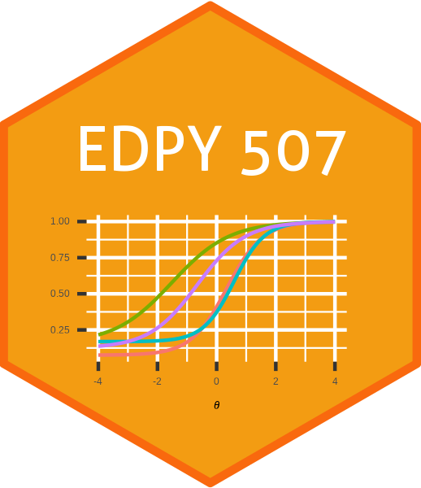

```{r load_packages, message=FALSE, warning=FALSE, include=FALSE} 
#remotes::install_github("mitchelloharawild/icons")
#devtools::install_github("ropenscilabs/icon")
#library("icons")
# https://www.r-bloggers.com/2018/05/icon-web-icons-for-rmarkdown/
library("fontawesome")
# Search icons: https://fontawesome.com/v5.15/icons
```

<br>
<center>

</center>
<br>
<br>

## About the Course

**EDPY 507 - Measurement Theory I** is designed for graduate students, researchers, and practitioners who want to develop, evaluate, and select measurement instruments in their professional roles. The course provides an introduction to the measurement concepts and models related to both classical test theory (CTT) and item response theory (IRT). The foundational concepts necessary to understand both theoretical positions will be presented first. Then, we will apply these two test theories to solve important contemporary problems in educational and psychological measurement.

<br>

## Instructor

`r fa("user-tie", fill = "black")` [Dr. Okan Bulut](https://sites.google.com/ualberta.ca/okanbulut/)

`r fa("landmark", fill = "black")` Education Centre North 6-110


`r fa("envelope", fill = "black")` <bulut@ualberta.ca>

`r fa("twitter", fill = "black")` [drokanbulut](https://twitter.com/drokanbulut)


<br>

## Required Textbooks

- Desjardins, C. D., & Bulut, O. (2018). [Handbook of educational measurement and psychometrics using R](https://www.routledge.com/Handbook-of-Educational-Measurement-and-Psychometrics-Using-R/Desjardins-Bulut/p/book/9780367734671). Boca Raton, FL: CRC Press.

- Finch, W. H., & French, B. F. (2018). [Educational and psychological measurement](ttps://doi.org/10.4324/9781315650951) (1st ed.). New York, NY: Routledge.

<br>

## Software

This semester, we will use the following software programs for conducting psychometric analysis:

- R (<https://cran.r-project.org/>)
- RStudio Desktop (<https://www.rstudio.com/products/rstudio/download/#download>)

