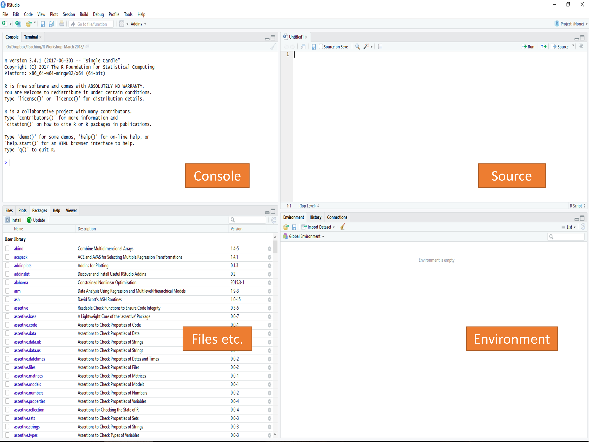
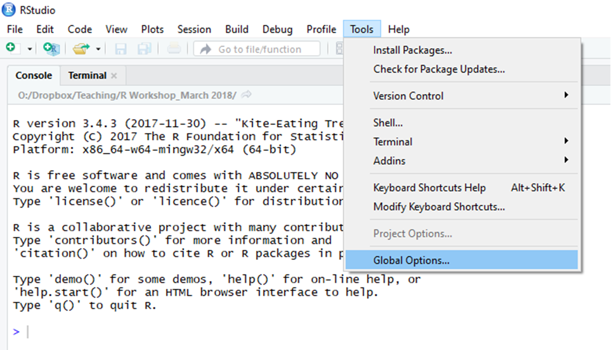
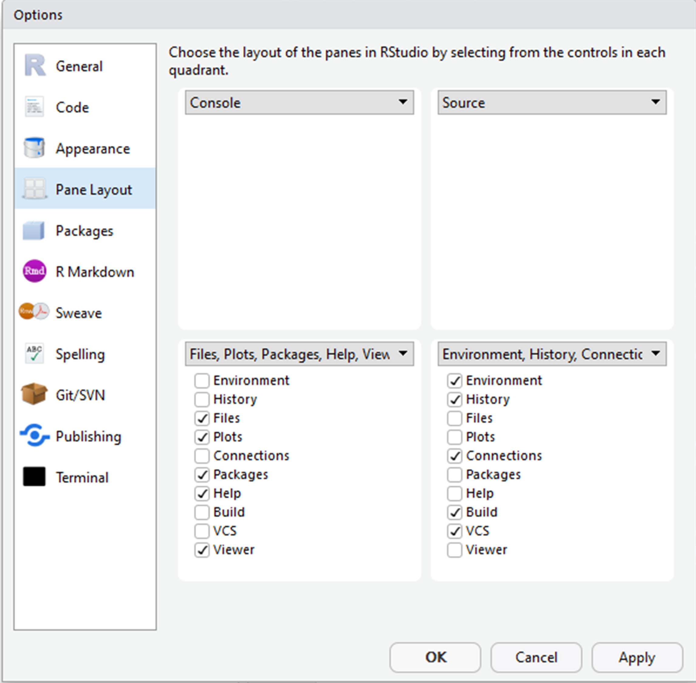
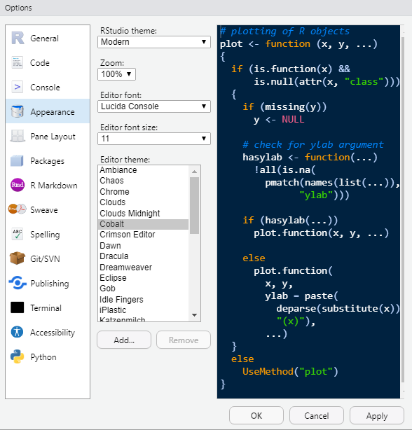
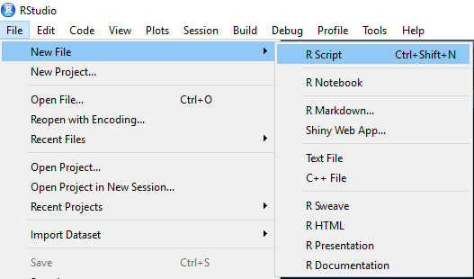
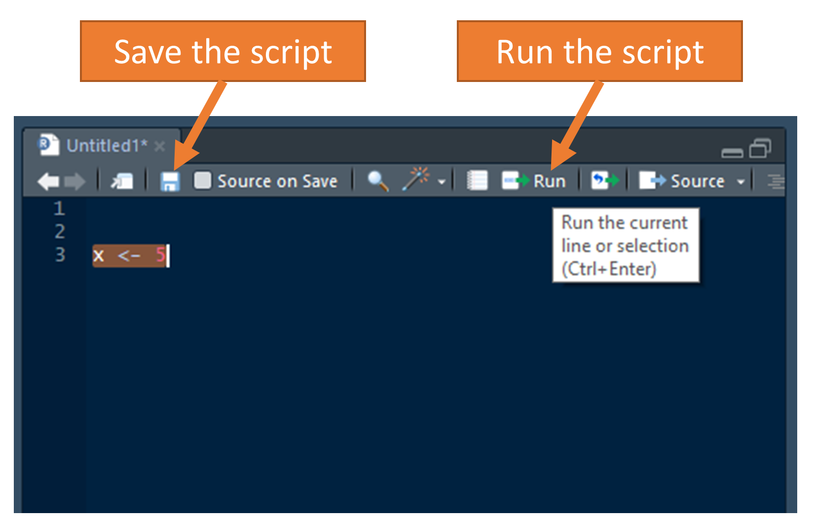
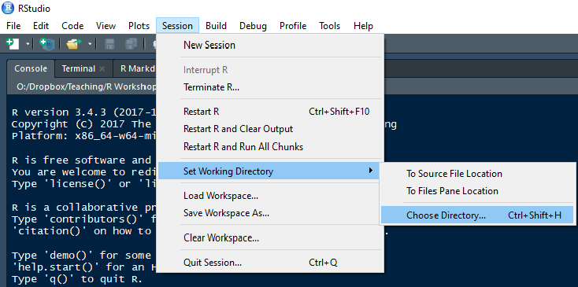

***

<br>

# R and RStudio


<br>

## What is R?

* is a free, open source program for statistical computing and data visualization.
* is cross-platform (e.g., available on Windows, Mac OS, and Linux).
* is maintained and regularly updated by the Comprehensive R Archive Network ([CRAN](https://cran.r-project.org/)).
* is capable of running all types of statistical analyses. 
* has amazing visualization capabilities (high-quality, customizable figures).
* enables reproducible research.
* has many other capablities, such as web programming.
* supports user-created packages (currently, more than 10,000)

<br>

## What is RStudio?
 
* is a free program available to control R.
* provides a more user-friendly interface for R.
* includes a set of tools to help you be more productive with R, such as:
    * A syntax-highlighting editor for highlighting your R codes
    * Functions for helping you type the R codes (auto-completion)
    * A variety of tools for creating and saving various plots (e.g., histograms, scatterplot)
    * A workspace management tool for importing or exporting data

<br/>

## Setting up R and RStudio

To benefit from RStudio, both R and RStudio should be installed in your computer. R and RStudio are freely available from the following websites:

To download and install R:

1. Go to [https://cran.r-project.org/](https://cran.r-project.org/)
2. Click "Download R for Mac/Windows""
3. Download the appropriate file:
• Windows users click Base, and download the installer for the latest R version
• Mac users select the file R-3.X.X.pkg that aligns with your OS version
4. Follow the instructions of the installer.

To download and install RStudio:

1. Go to [https://www.rstudio.com/products/rstudio/download/](https://www.rstudio.com/products/rstudio/download/)
2. Click "Download" under *RStudio Desktop - Open Source License*
3. Select the install file for your OS
4. Follow the instructions of the installer.


After you open RStudio, you should see the following screen:



<br/>

I personally prefer console on the top-left, source on the top-right, files on the bottom-left, and environment on the bottom-right. The pane layout can be updated using *Global Options* under *Tools*. 



<br/>



<br/>

We can also change the appearance (e.g., code highlighting, font type, font size, etc.):



<br/>

__Note:__ To get yourself more familiar with RStudio, I recommend you to check out the RStudio [cheatsheet](resources/rstudio-ide.pdf) and Oscar Torres-Reyna's nice [tutorial](resources/rstudio_tutorial.pdf).

<br/>

## Creating a new script

In R, we can type our commands in the console; but once we close R, everything we have typed will be gone. Therefore, we should create an empty script, write the codes in the script, and save it for future use. We can replicate the exact same analysis and results by running the script again later on. The R script file has the .R extension, but it is essentially a text file. Thus, any text editor (e.g., Microsoft Word, Notepad, TextPad) can be used to open a script file for editing outside of the R environment. 

We can create a new script file in R as follows:



<br/>

When we type some codes in the script, we can select the lines we want to run and then hit the run button. Alternatively, we can bring the cursor at the beginning of the line and hit the run button which runs one line at a time and moves to the next line.



<br/>

## Changing working directory

An important feature of R is "working directory", which refers to a location or a folder in your computer where you keep your R script, your data files, etc.  Once we define a working directory in R, any data file or script within that directory can be easily imported into R without specifying where the file is located. By default, R chooses a particular location in your computer (typically Desktop or Documents) as your working director. To see our current working director, we need to run a `getwd()` command in the R console:

```{r ch1.1, eval=FALSE}
getwd()
```

This will return a path like this:

```{r ch1.2, eval=FALSE}
## [1] "C:/Users/bulut/Desktop"
```

Once we decide to change the current working direcory into a different location, we can do it in two ways:  

__Method 1:__ Using the "Session" options menu in __RStudio__  

We can select Session > Set Working Directory > Choose Directory to find a folder or location that we want to set as our current working directory. 

<br/>



<br/>

__Method 2:__ Using the `setwd` command in the console  

Tpying the following code in the console will set a hypothetical "edpy507" folder on my desktop as the working directory. If the folder path is correct, R changes the working directory without giving any error messages in the console. 

```{r ch1.3, eval=FALSE}
setwd("C:/Users/bulut/Desktop/edpy507")
```

To ensure that the working directory is properly set, we can use the ``getwd()`` command again:

```{r ch1.4, eval=FALSE}
getwd()
## [1] "C:/Users/bulut/Desktop/edpy507"
```

**IMPORTANT:** R does not accept any backslashes in the file path. Instead of a backslash, we need to use a frontslash. This is particulary important for Windows computers since the file paths involve backslashes (Mac OS X doesn't have this problem).

<br/>

## Downloading and installing R packages

The base R program comes with many built-in functions to compute a variety of statistics and to create graphics (e.g., histograms, scatterplots, etc.). However, what makes R more powerful than other software programs is that R users can write their own functions, put them in a package, and share it with other R users via the [CRAN](https://cran.r-project.org/web/packages/index.html) website.

For example, `ggplot2` [@R-ggplot2] is a well-known R package, created by Hadley Wickham and Winston Chang. This package allows R users to create elegant data visualizations. To download and install the `ggplot2` package, we need to use the `install.packages` command. Note that your computer has to be connected to the internet to be able to connect to the CRAN website and download the package. 

```{r ch1.5, eval=FALSE}
install.packages("ggplot2")
```

Once a package is downloaded and installed, it is permanently in your R folder. That is, there is no need to re-install it, unless you remove the package or install a new version of R. These downloaded packages are not directly accessible until we activate them in your R session. Whenever we need to access a package in R, we need to use the `library` command to activate it. For example, to access the `ggplot2` package, we would use: 

```{r ch1.6.1, eval=FALSE}
library("ggplot2")
```

To get help on installed packages (e.g., what's inside this package):

```{r ch1.6.2, eval=FALSE}
# To get details regarding contents of a package
help(package = "ggplot2")

# To list vignettes available for a specific package
vignette(package = "ggplot2")

# To view specific vignette
vignette("ggplot2-specs")
```

***
<br/>

# Basics of the R Language

<br/>

## Creating new variables

To create a new variable in R, we use the assignment operator, `<-`. To create a variable `x` that equals 25, we need to type:

```{r ch1.10}
x <- 25
```

If we want to print `x`, we just type `x` in the console and hit enter. R returns the value assigned to `x`.

```{r ch1.11}
x
```

We can also create a variable that holds multiple values in it, using the `c` command (**c** stands for *combine*).

```{r ch1.12}
weight <- c(60, 72, 80, 84, 56)
weight

height <- c(1.7, 1.75, 1.8, 1.9, 1.6)
height
```

Once we create a variable, we can do further calculations with it. Let's say we want to transform the `weight` variable (in kg) to a new variable called weight2 (in lbs).

```{r ch1.13}
weight2 <- weight * 2.20462
weight2
```

Note that we named the variable as `weight2`. So, both `weight` and `weight2` exist in the active R session now. If we used the following, this would overwrite the existing `weight` variable.

```{r ch1.14, eval = FALSE}
weight <- weight * 2.20462
```

We can also define a new variable based on existing variables.

```{r ch1.15}
reading <- c(80, 75, 50, 44, 65)
math <- c(90, 65, 60, 38, 70)
total <- reading + math
total
```

Sometimes we need a variable that holds character strings rather than numerical values. If a value is not numerical, we need to use double quotation marks. In the example below, we create a new variable called `cities` that has four city names in it. Each city name is written with double quotation marks.

```{r ch1.16}
cities <- c("Edmonton", "Calgary", "Red Deer", "Spruce Grove")
cities
```

We can also treat numerical values as character strings. For example, assume that we have a `gender` variable where 1=Male and 2=Female. We want R to know that these values are not actual numbers; instead, they are just numerical labels for gender groups.

```{r ch1.17}
gender <- c("1", "2", "2", "1", "2")
gender
```

<br/>

## Important rules of the R language

Here is a list of important rules for using the R language more effectively:

1. __Case-sensitivity:__ R codes written in lowercase would NOT refer to the same codes written in uppercase.

```{r ch1.18, eval=FALSE}
cities <- c("Edmonton", "Calgary", "Red Deer", "Spruce Grove")
Cities
CITIES

Error: object 'Cities' not found
Error: object 'CITIES' not found
```

2. __Variable names:__ A variable name **cannot** begin with a number or include a space. 

```{r ch1.19, eval=FALSE}
4cities <- c("Edmonton", "Calgary", "Red Deer", "Spruce Grove")
my cities <- c("Edmonton", "Calgary", "Red Deer", "Spruce Grove")

Error: unexpected symbol in "4cities"
Error: unexpected symbol in "my cities"
```

3. __Naming conventions:__ I recommend using consistent and clear naming conventions to keep the codes clear and organized. I personally prefer all lowercase with underscore (e.g., `my_variable`). The other naming conventions are:

* All lowercase: e.g. `mycities`
* Period.separated: e.g. `my.cities`
* Underscore_separated: e.g. `my_cities`
* Numbers at the end: e.g. `mycities2018`
* Combination of some of these rules: `my.cities.2018`     

4. __Commenting:__ The hashtag symbol (\#) is used for commenting in R. Any words, codes, etc. coming after a hashtag are just ignored. I strongly recommend you to use comments throughout your codes. These annotations would remind you what you did in the codes and why you did it that way. You can easily comment out a line without having to remove it from your codes.

```{r ch1.20, eval=FALSE}
# Here I define four cities in Alberta
cities <- c("Edmonton", "Calgary", "Red Deer", "Spruce Grove")
```

<br/>

## Self-help

In the spirit of open-source, R is very much a self-guided tool. We can look for solutions to R-related problems in multiple ways:

1. Use the `?` to open help pages for functions or packages (e.g., try `?summary` in the console to see how the `summary` function works).

2. For tricky questions and funky error messages (there are many of these), use [Google](https://www.google.com/) (include "in R" to the end of your query).

3. We can also use RSeek (<https://rseek.org/>) - a search engine just for R.

4. StackOverflow (<https://stackoverflow.com/>) has become a great resource with many questions for many specific packages in R, and a rating system for answers.

<br>

# References


